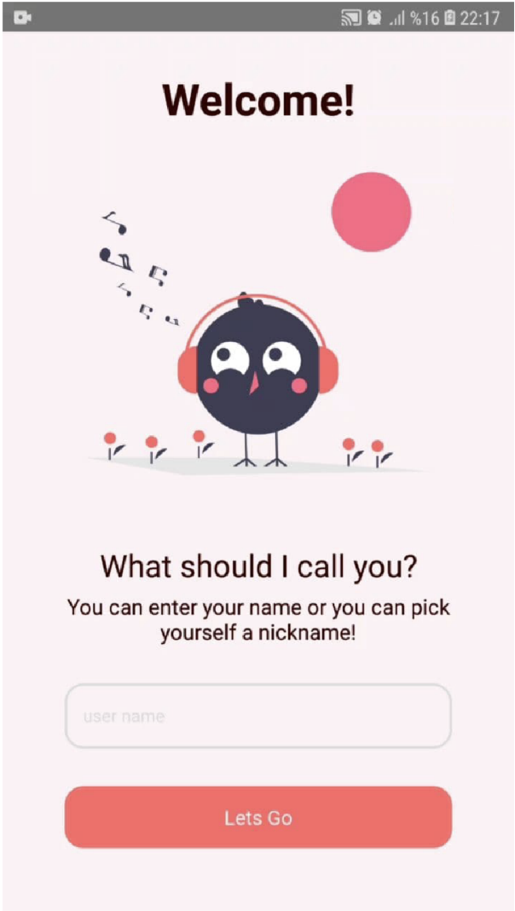
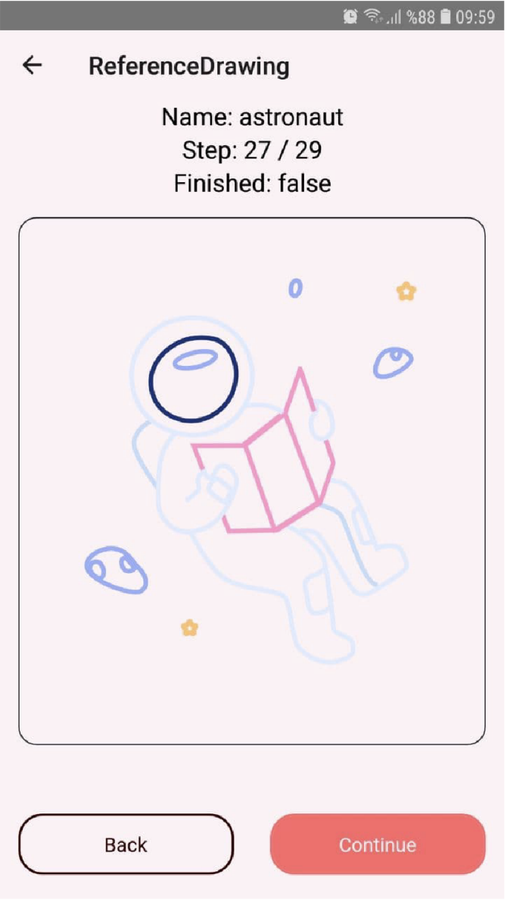
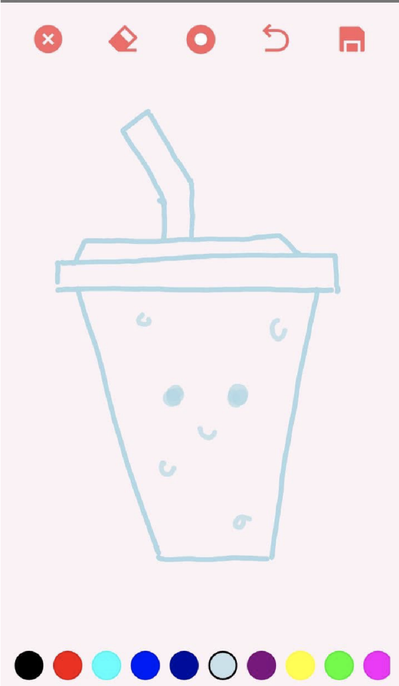
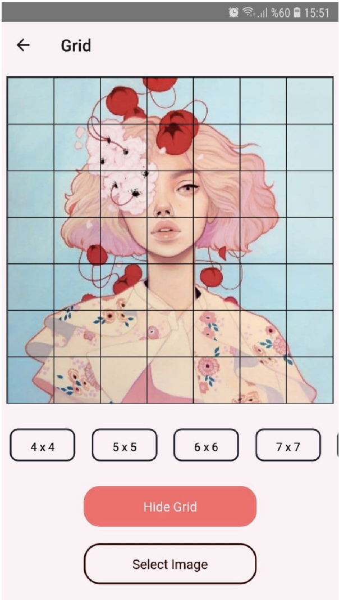

# Dorothea - Drawing Assistant with React Native

Dorothea is a mobile application developed using React Native that assists users in improving their drawing skills. 
It provides daily drawing topics, structured practices, and additional tools to enhance the drawing experience. The app is designed to work on both Android and iOS devices.

## Features

- **Daily Drawing Topics**: Offers new drawing ideas every day to spark creativity.
- **Practice Section**: Step-by-step animated drawing exercises and doodle guides.
- **Progress Tracking**: Displays completed practices.
- **Grid & Ruler Tools**: Helps users with structured drawing and alignment.
- **Canvas & Camera Integration**: Allows drawing on a digital canvas or capturing images for reference.

 ### Screenshots

#### Landing Page
  

#### Drawing Practice
 

#### Canvas


#### Grid
 


## Technologies Used

- **React Native**: Cross-platform mobile development.
- **AsyncStorage**: Local storage for user data.
- **Lottie**: Animated drawings using JSON from Adobe After Effects.
- **Figma & Adobe Illustrator**: Design and illustration tools.
- **React Native Libraries**: Various third-party libraries for enhanced functionality.

## Installation

To run the project locally, follow these steps:

```bash
# Clone the repository
git clone https://github.com/yourusername/dorothea.git

# Navigate to the project folder
cd dorothea

# Install dependencies
npm install

# Run the application on Android or iOS
npx react-native run-android  # For Android
npx react-native run-ios      # For iOS (requires macOS)
```
## Contributing
Contributions are welcome! If you find a bug or have an idea for improvement, please submit an issue or open a pull request.
